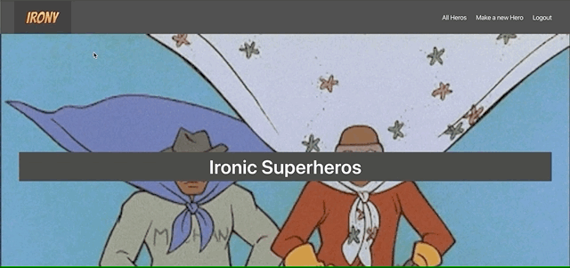
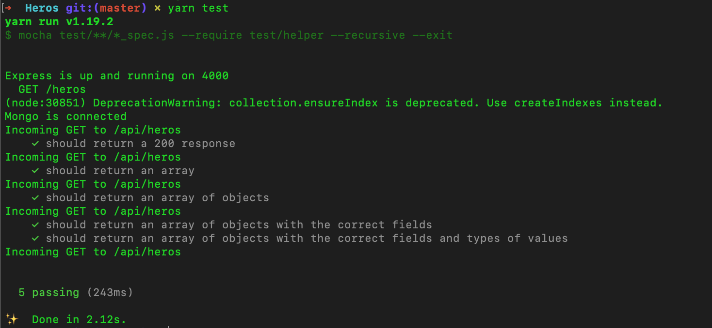

# 

<h1>Personal Project One: Irony</h1>

<h2>Goal: Gain a basic understanding of full-stack RESTful MERN apps</h2>

| Contents                      |                |
| ------------------------------|----------------|
|1. [Overview](#overview)       |6. [Future content](#future)
|2. [Brief](#brief)             |7. [Wins](#wins)
|3. [Technologies used](#tech)  |8. [Blockers](#blockers)
|4. [App](#app)                 |9. [Bugs](#bugs)
|5. [Approach](#approach)       |10. [Future learnings](#learn)

<h2 name='overview'>Overview</h2>

<h3>Introduction</h3>

Irony is a quick personal project I started to get to grips with full-stack apps before I begin my third project at GA. The app allows a user to view Ironic heros, and if the user created them they can edit and delete them. The user can create a profile and login and out but cannot delete or edit their profile.

<h3>Deployment</h3>

The app is deployed on Heroku and can be found here: https://git.heroku.com/irony-ga.git <br>
The login details are  email: james@email password: IronicHeros19 <br>

<h3>Timeframe</h3>

5 days

<h2 name='brief'>Brief</h2>

* **Gain an understanding of full-stack apps** – as a test project I want to increase my understanding of the back-end specifically.
* **Keep it simple and small** - no need to add all the bells and whistles, just work on functionality
* **Leave comments** -  to use as a reference in the future.
* **Do not worry about styling**
* **Be deployed online**

<h2 name='tech'>Technologies used</h2>
<p>1. HTML5 <br>
2. SCSS & Bulma <br>
3. JavaScript (ES6) <br>
4. JSON <br>
5. React.js <br>
6. Node.js <br>
7. Express.js <br>
8. Axios <br>
9. Mongoose & MongoDB <br>
10. Mocha & Chai <br>
11. Insomnia <br>
12. bcrypt <br>
13. Z shell <br>
14. JWT <br>
15. Toast <br>
16. Yarn <br>
17. Heroku <br>
18. GitHub <br></p>

<h2 name='app'>App</h2>

The user can use the nav bar to search for all the heros, this uses a GET request to index all the heros in the database. Each hero card is a link to that heros own page, which is another GET request but to a url that contains that heros ID which the get request can use to find the specific hero.<br>
<br>
<br>

<br>
<br>
<br>
To create or edit a Hero the user must log in because they are required for the hero model.<br>
<br>
<br>

<br>
<br>
<br>
<h2 name='future'>Future content</h2>
<h3>Comments and likes</h3>
I was planning on bringing in comments and likes as you can see from the heros.js file in controllers.

```javascript
function commentCreate(req, res, next) { // comment create - /heros/:id/comments 
  req.body.user = req.currentUser
  Hero
    .findById(req.params.id) // first find the hero by its id
    .then(hero => {
      if (!hero) return res.status(404).json({ message: 'Not Found' }) // return res 404 if not found
      hero.comments.push(req.body) // otherwise push the new comment into the heros comment array
      return hero.save() //  then resave the hero with the new comment
    })
    .then(hero => res.status(201).json(hero)) // send that hero with the new comment back
    .catch(next) // send any errors
}

function commentDelete(req, res) { // comment delete - /heros/:id/comments/:commentId
  Hero
    .findById(req.params.id) // find the hero with the comment to be deleted
    .then(hero => {
      if (!hero) return res.status(404).json({ message: 'Not Found' })
      const comment = hero.comments.id(req.params.commentId) // find the comment on that hero that needs to be deleted
      if (!comment.user.equals(req.currentUser._id)) return res.status(401).json({ message: 'Unauthorized' }) // check the user making the request is the same user that posted the comment, we know this from our current user as this is a secure route. If not, return unauthorised and don't delete the comment
      comment.remove() // remove that comment
      return hero.save().then(() => res.sendStatus(204)) //resave the hero with that new comment removed
    }
    )
    .catch(err => res.status(401).json(err)) //send any errors
}
function like(req, res) {
  Hero
    .findById(req.params.id)
    .then(hero => {
      if (!hero) return res.status(404).json({ message: 'Not Found ' })
      hero.likes.push(req.currentUser)
      return hero.save()
    })
    .then(hero => res.status(202).json(hero))
    .catch(err => res.json(err))
}
```

<br>
<br>
<br>
<h2 name='wins'>Wins</h2>
<h3>Testing</h3>
I created 5 test that passed in this project which is a small win as I understand how important tests are. However i see there is a lot more work to be done to fully grasp this concept.
<br>
<br>
<br>

<br>
<br>
<br>
<h3>Models</h3>
I feel this quick project has helped me get a good grasp of the back-end, seeing that it works in the same sort of way as the front-end has really helped me demystify it. The basics of building the models seem to be easy and even fun, like adding extra schemas that work in slightly different ways or could be their own models.

```javascript
const mongoose = require('mongoose')

const commentSchema = new mongoose.Schema({
  text: { type: String, required: true }, // the text of the comment
  user: { type: mongoose.Schema.ObjectId, ref: 'User', required: true } // the user who is making the comment, this is a referenced relationship
}, {
  timestamps: true
})

const likeSchema = new mongoose.Schema({
  user: { type: mongoose.Schema.ObjectId, ref: 'User', required: true }
}, {
  timestamps: true
})

const heroSchema = new mongoose.Schema({
  name: { type: String, required: true, unique: true },
  power: { type: String, required: true, maxlength: 200 },
  evil: { type: String, required: true },
  irony: { type: Number, required: true, min: 1, max: 10 },
  image: { type: String, required: true },
  comments: [ commentSchema ], // adding our commentSchema as an embedded array in the hero model, our comments will be objects following the schema seen above // another required string, but this one has a max length
  user: { type: mongoose.Schema.ObjectId, ref: 'User', required: true }, // our referenced to the USER model, attaching a user field and defining that it will be a user model.
  likes: [ likeSchema ]
}, {
  timestamps: true
})

heroSchema
  .virtual('likeCount')
  .get(function() {
    return this.likes.length
  })

heroSchema.set('toJSON', { virtuals: true })


heroSchema.plugin(require('mongoose-unique-validator'))

module.exports = mongoose.model('Hero', heroSchema)
```
<br>
<br>
<br>
<h3>Controllers</h3>
Seeing how the controllers and the router essentially manage the back-end by passing request to the correct places by using functions was a relief as I quickly understood this concept and could happily console.log my way though any issues.
<br>
<br>
<h2 name='blockers'>Blockers</h2>
<h3>Auth</h3>
The front-end authentication was a little more tricky for me to work with. Giving the user a token with which they can use to access components challenged my preconceptions of how websites worked.
<br>
<br>
<h2 name='bugs'>Bugs</h2>
As it's such a small app I can't find any bugs at this time<br>
<br>
<br>
<h2 name='learn'>Future learnings</h2>
• Learn how to attach models with comments and likes<br>
• Work with more tests<br>

